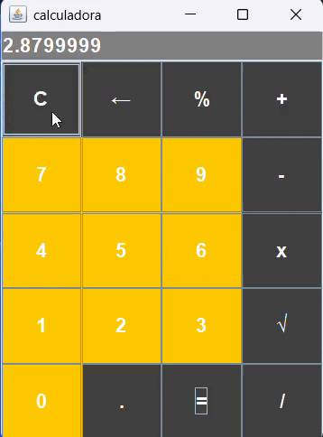

# 🧮 Calculadora Java Swing

Uma calculadora de operações básicas desenvolvida em **Java Swing** como parte dos meus estudos de Java e Programação Orientada a Objetos.

O projeto começou como uma calculadora executada pelo terminal e posteriormente foi transformado em uma aplicação com **interface gráfica**, utilizando componentes do Swing.

## 📸 Demonstração

### 🎥 GIF da aplicação




## ✨ Funcionalidades

A calculadora atualmente possui:

* ➕ Adição
* ➖ Subtração
* ✖️ Multiplicação
* ➗ Divisão
* ✔️ Raiz Quadrada
* ％ Porcentagem
* 🔢 Números decimais
* 🧹 Limpeza do visor
* ⚠️ Tratamento de divisão por zero
* 🖥️ Interface gráfica utilizando Java Swing

---

## 🛠️ Tecnologias utilizadas

* **Java**
* **Java Swing**
* **AWT**
* **Programação Orientada a Objetos**

---

## 📚 Conceitos praticados

Durante o desenvolvimento deste projeto, pratiquei:

* Classes e objetos
* Métodos
* Variáveis de instância
* Separação da lógica da aplicação
* `JFrame`
* `JPanel`
* `JButton`
* `JTextField`
* `GridLayout`
* `BorderLayout`
* `ActionListener`
* Expressões lambda
* `switch`
* Conversão de `String` para `float`
* Conversão de `float` para `String`
* Tratamento de exceções
* `ArithmeticException`

---

## 📂 Estrutura do projeto

```text
calculadora-java-swing/
│
├── src/
│   └── Interface.java
│
├── docs/
│   ├── calculadora.png
│   └── calculadora.gif
│
└── README.md
```

### Descrição

| Arquivo/Pasta    | Função                                      |
| ---------------- | ------------------------------------------- |
| `src/`           | Código-fonte do projeto                     |
| `Interface.java` | Interface gráfica e interação com o usuário |
| `docs/`          | Imagens e GIFs utilizados no README         |
| `README.md`      | Documentação do projeto                     |

---

## 🚀 Como executar

### Pré-requisitos

Para executar o projeto, você precisa ter instalado:

* **JDK (Java Development Kit)**
* Um editor ou IDE, como VS Code, IntelliJ IDEA ou Eclipse

### 1. Clone o repositório

```bash
git clone https://github.com/SEU-USUARIO/calculadora-java-swing.git
```

### 2. Entre na pasta

```bash
cd calculadora-java-swing
```

### 3. Compile o projeto

```bash
javac src/Interface.java
```

### 4. Execute

```bash
java -cp src Main
```

A janela da calculadora será aberta.

---

## 🧠 Como funciona

A interface gráfica é construída utilizando componentes do **Java Swing**.

O usuário interage com os botões e os valores são armazenados no `JTextField` utilizado como visor.

Quando uma operação é escolhida, o programa guarda:

* O primeiro número;
* A operação escolhida.

Ao pressionar `=`, o segundo número é obtido e a classe `Operacao` realiza o cálculo correspondente.

A classe `Operacao` possui métodos separados para cada operação:

```java
soma()
subtracao()
mutiplicacao()
divisao()
```

A divisão por zero também é tratada através de uma `ArithmeticException`.

---

## 🔮 Próximas melhorias
* [ ] Permitir operações consecutivas
* [ ] Adicionar teclado numérico
* [ ] Impedir a entrada de dois pontos decimais no mesmo número
* [ ] Melhorar o tratamento de entradas inválidas
* [ ] Adicionar outras operações matemática

---

## 👨‍💻 Autor

**João Pedro**

Projeto desenvolvido durante meus estudos de Java e Java Swing.

Este projeto representa uma etapa da minha evolução no desenvolvimento de aplicações Java, começando com programas executados no terminal e avançando para interfaces gráficas.

---

⭐ Se este projeto foi útil ou interessante para você, considere deixar uma estrela no repositório!
